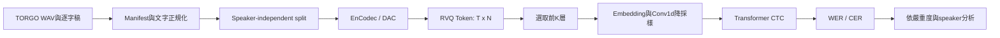
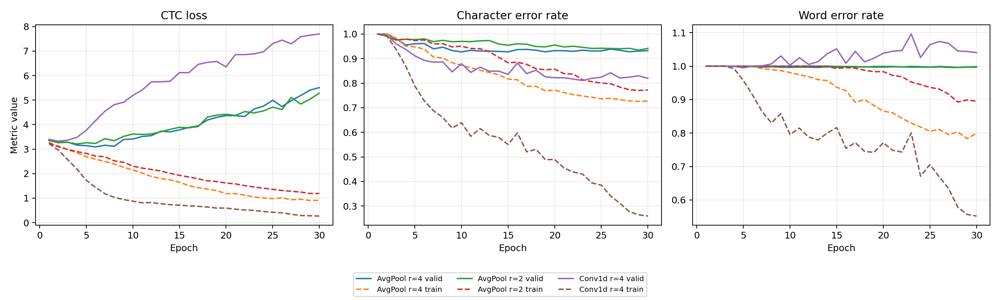
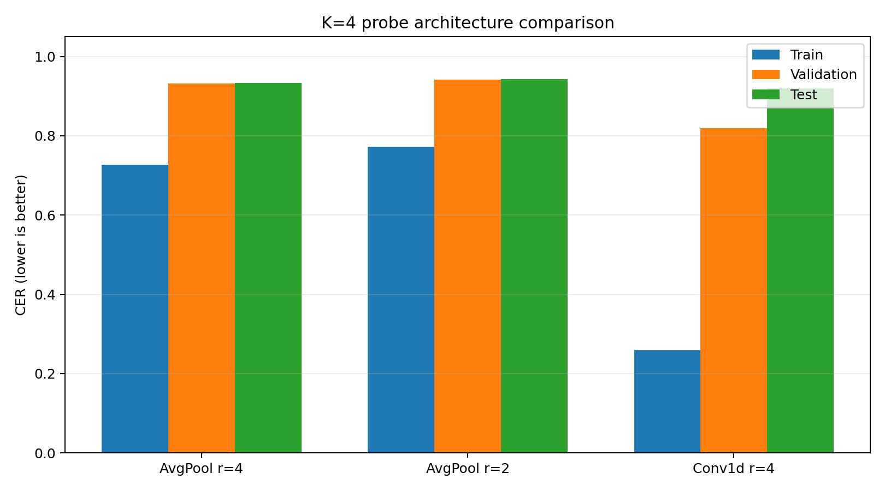
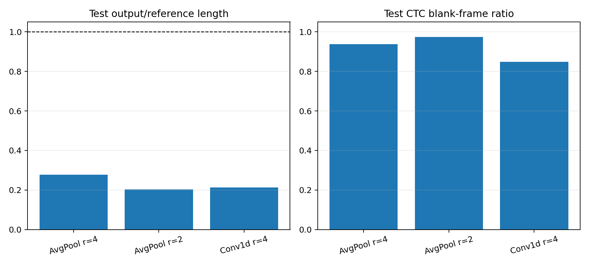

# 離散 Token 與 RVQ 層級敏感度分析：研究進度報告

## 一、研究目標

本研究使用預訓練 Neural Audio Codec 將 TORGO 構音障礙語音轉換為離散 RVQ Token，並訓練固定容量的輕量 ASR probe，比較只輸入 Q1、Q1:Q2、Q1:Q4、Q1:Q6 與 Q1:Q8 時的 WER/CER。核心問題是：對 Severe 患者而言，Q5–Q8 是否主要編碼無助於辨識的病理聲學細節，移除後反而能降低 WER？



## 二、已完成工作

### 1. TORGO資料管線

- 建立標準 JSONL manifest，保留原始與正規化逐字稿。
- 固定使用 headMic，檢查 WAV、路徑、重複ID與音訊長度。
- 建立speaker-independent train/validation/test split，確認無speaker leakage。
- 嚴重度設定：Severe為F01/M01/M02/M04，Moderate-to-Severe為M05，Moderate為F03；F04/M03依研究protocol排除。
- 最終納入7,140筆：train 2,529、validation 2,570、test 2,041。

### 2. Codec Token提取

- EnCodec 24 kHz、6 kbps全量提取完成。
- 共7,140筆成功、0筆失敗；每筆Token為 `[T,8]`。
- 每層codebook size為1,024，並保存speaker、severity、split與transcript。
- 已建立DAC 16/24/44 kHz提取器，加入正確重採樣與共同 `[T,N]` 介面。

### 3. 共用ASR Probe

- 建立RVQ Token Dataset/DataLoader、字元tokenizer、Transformer-CTC及greedy decoding。
- 支援 `K=1/2/4/6/8`，所有K均保留完整embedding參數量以維持公平。\(K\)：這次實驗實際使用前幾層

| K | 模型輸入 | 意義 |
|---:|---|---|
| 1 | `codes[:, :1]` | 只用 Q1 |
| 2 | `codes[:, :2]` | 使用 Q1–Q2 |
| 4 | `codes[:, :4]` | 使用 Q1–Q4 |
| 6 | `codes[:, :6]` | 使用 Q1–Q6 |
| 8 | `codes[:, :8]` | 使用完整 Q1–Q8 |

- 評估包含WER、CER、speaker/severity分組、空輸出率、輸出長度比與CTC blank比例。
- 加入overfit mode、gradient accumulation及可學習Conv1d subsampling。

## 三、管線驗證

100筆小資料overfit測試達到：

| 指標 | 結果 |
|---|---:|
| WER | 0.00% |
| CER | 0.00% |
| 輸出/參考長度比 | 1.000 |
| 空輸出比例 | 0.00% |
| CTC blank-frame比例 | 約74.45% |

此結果證明Token讀取、RVQ切片、模型forward/backward、CTC target、解碼與評估流程正確。因此完整資料的高WER不能歸因於程式管線損壞。

## 四、K=4診斷實驗

| 模型 | Train CER | Valid CER | Test CER | Test長度比 |
|---|---:|---:|---:|---:|
| AvgPool，reduction=4 | 72.72% | 93.23% | 93.33% | 0.277 |
| AvgPool，reduction=2 | 77.20% | 94.15% | 94.28% | 0.203 |
| Conv1d，reduction=4 | 25.93% | 81.96% | 91.92%* | 0.212* |

`*` Test使用validation WER最佳checkpoint，不一定是epoch 30或validation CER最佳checkpoint，解讀時需同時報告best epoch與selection criterion。

Conv1d使train CER由72.72%降至25.93%，epoch-30 validation CER降至81.96%，顯示learned subsampling明顯優於固定平均。然而未見speaker的test CER仍高，主要瓶頸已由「模型無法學習」轉為「跨speaker泛化與單字邊界」。WER可超過100%，因為錯誤空格會造成大量word insertions。







## 五、目前可下與不可下的結論

可以確認：離散Token含有足以辨識文字的資訊；Conv1d subsampling比固定AvgPool更適合；現有模型在train speaker上的能力顯著提升，但跨speaker泛化仍不足。

目前不能宣稱Q5–Q8對Severe語音有害，因為正式K層消融尚未開始，且目前固定test split沒有Severe speaker。若直接比較各K，結果會混入probe泛化能力與split組成的影響。

## 六、下一步與里程碑

1. 固定Conv1d、reduction=4及effective batch size，加入early stopping與明確checkpoint criterion。
2. 檢查空格造成的insertion，補報含空格CER與不含空格CER。
3. 改善K=4 speaker-independent baseline，並評估Conformer或CTC beam search。
4. 建立speaker-level cross-validation，使F01/M01/M02/M04等Severe speakers輪流測試。
5. 固定probe後執行K=1/2/4/6/8，每組至少3個seeds。
6. 依speaker與severity彙整WER/CER，使用paired bootstrap或speaker-level統計檢定。
7. 完成DAC全量驗證，使用相同probe重複實驗；跨Codec同時報告frame rate、bitrate與codebook數量。
8. 執行快速重建音訊實驗：分別使用Q1、Q1:Q2、Q1:Q4、Q1:Q6、Q1:Q8重建WAV，再以固定的faster-whisper checkpoint與beam size評估。此路線可先取得RVQ層數對成熟ASR的趨勢，並與直接Token probe交叉驗證。
9. 對F01/M01/M02/M04分別執行K4與K8的paired utterance bootstrap。定義差值為 `WER(K8)-WER(K4)`；95%信賴區間完全小於0代表K8改善，完全大於0代表捨棄高層的K4較好，跨越0則證據不足。

## 七、目前正在進行的內容

目前研究位於「K=4 ASR probe穩定化與錯誤診斷」階段，尚未進入正式Q1–Q8消融。現階段以EnCodec Q1:Q4作為開發條件，原因是它同時包含低層主要聲學資訊及部分殘差資訊，適合先確認probe是否具備基本辨識能力。

目前具體工作包括：

1. 比較固定AvgPool與learned Conv1d subsampling。Conv1d已使train CER由約72.72%降至25.93%，證明可學習的局部時間壓縮較適合Codec Token。
2. 診斷train與未見speaker之間的泛化落差。雖然100筆資料可達WER/CER 0，但完整validation/test仍偏高，顯示主要問題已轉為小資料下的speaker generalization。
3. 檢查CTC輸出行為，包括blank-frame比例、空輸出比例及hypothesis/reference長度比，以區分blank collapse、deletion與insertion。
4. 檢查逐句Reference/Hypothesis及空格錯誤。CER改善但WER仍高，可能是字元已有部分正確，但錯誤word boundaries造成大量word insertions。
5. 固定可信的checkpoint selection、early stopping與訓練設定。完成後才會鎖定probe，執行K=1/2/4/6/8與多個random seeds。

目前研究重點不是追求單次最低WER，而是建立一個容量固定、可重現且不會掩蓋RVQ層級效果的probe。只有probe本身穩定後，才能將不同K之間的差異合理歸因於RVQ資訊分布。

Greedy decoding前的frame-level輸出也可選擇保存。使用 `--save-frame-outputs` 時，每句會保存 `[T,V]` logits、frame-level argmax IDs、CTC blank ID及完整字彙。這些資料可用於觀察blank posterior、比較beam search或重新解碼，而不必重新執行模型forward。

## 八、WER/CER逐句文字比對表

訓練程式輸出的 `test_predictions.jsonl` 包含每句reference與hypothesis。可使用下列指令產生全量CSV及可直接放入報告的Markdown表格：

```bash
python 04_Code/rvq_asr/reports/build_prediction_table.py \
  --predictions 04_Code/rvq_asr/runs/encodec_k4_conv/test_predictions.jsonl \
  --output-dir 04_Code/rvq_asr/reports/prediction_tables/encodec_k4_conv \
  --markdown-rows 50
```

輸出包含speaker、severity、reference、hypothesis、逐句WER、逐句CER、edit數、輸出長度比及是否為空輸出。逐句WER可高於1，代表insertions多於reference word數；CER依目前實驗定義忽略空格。

| Reference | Hypothesis | WER | CER | 解讀 |
|---|---|---:|---:|---|
| BORN | BO | 1.000 | 0.500 | 字元不足，主要為deletion |
| NO | BO | 1.000 | 0.500 | 一個字元substitution |
| AIR | A | 1.000 | 0.667 | 輸出序列過短 |
| HE SLOWLY TAKES A SHORT WALK IN THE OPEN AIR EACH DAY | (empty) | 1.000 | 1.000 | 完整blank/deletion錯誤 |

上述表格僅示範診斷方式；正式報告應由腳本直接從指定checkpoint的prediction檔產生，避免混用不同run結果。

## 九、向教授報告時的重點

- 資料與Token提取已完成，EnCodec全量無失敗。
- 100筆overfit達到零錯誤，證明實驗管線有效。
- 初始AvgPool probe無法良好學習；改用Conv1d後train CER大幅改善。
- 當前主要風險是小資料下的跨speaker泛化與不完整的severity test coverage。
- 下一階段不是立即宣告RVQ層級效果，而是先固定可信的probe與cross-validation protocol，再做正式消融。

## 十、圖表產生方式

在伺服器專案根目錄執行：

```bash
python 04_Code/rvq_asr/reports/plot_progress.py \
  --runs-root 04_Code/rvq_asr/runs \
  --output-dir 04_Code/rvq_asr/reports/figures
```

若環境缺少繪圖套件，安裝 `matplotlib`。程式會輸出三張PNG與 `experiment_summary.csv`，數值直接取自各run的 `results.json`。
